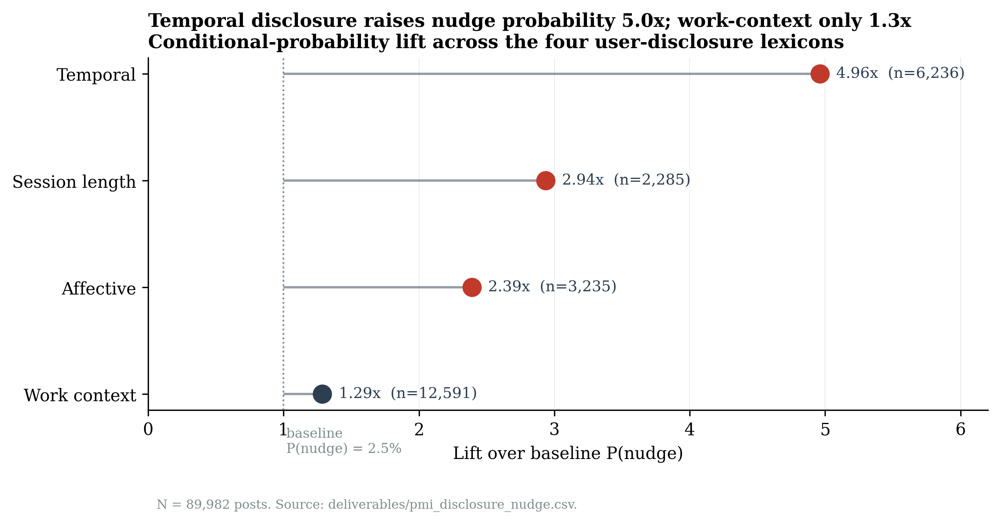
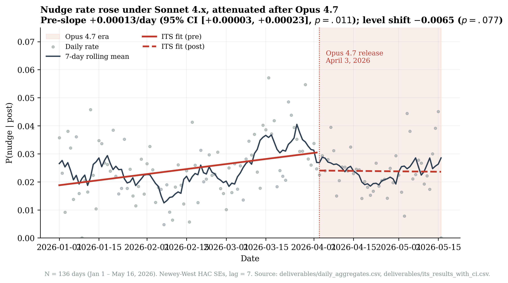
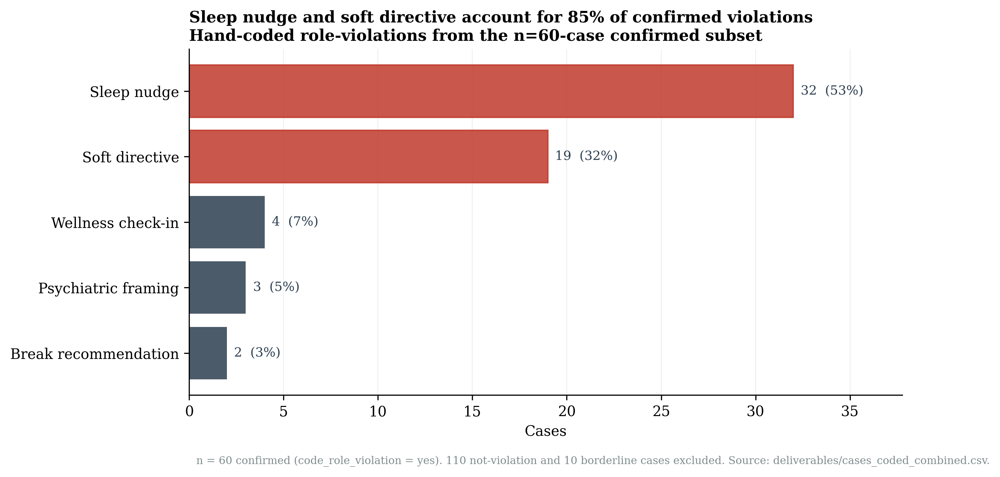

# Care Without Consent: Empirical Evidence of a Persistent Class of Role-Violation in Production Large Language Models

**A Reddit Corpus Analysis Spanning the Sonnet 4.5 Long-Conversation Reminder Era and the Opus 4.7 Sleep-Nudge Phenomenon**

Heather Leffew, PhD
Forevue Insights
heatherleffew@forevueinsights.com

*Draft preprint, May 2026. *

---

## Abstract

Following the April 2026 release of Anthropic's Claude Opus 4.7, end users in Claude-related online communities reported that the model issued unsolicited directives to sleep, rest, or end work sessions, frequently without contextual warrant and at incongruent times of day. The behavior succeeded by approximately six months a structurally adjacent failure mode in the prior Claude Sonnet 4.5 generation, in which the model produced unsolicited psychiatric attributions during extended conversations. Public commentary has characterized the two episodes as discrete, model-specific quirks. This paper evaluates the alternative hypothesis that both behaviors instantiate a single behavioral class: unsanctioned role-taking by an AI assistant under cover of wellness-coded language. A corpus of 89,982 Reddit posts spanning January through May 2026, covering both pre- and post-release windows around the Opus 4.7 launch, was assembled and analyzed via lexicon-based feature engineering, pointwise mutual information, segmented-regression interrupted time series analysis with Newey-West heteroskedasticity- and autocorrelation-consistent standard errors, K-means population stratification, and hand-coded structural categorization of 180 high-evidence cases across nine dimensions. The base rate of detected sleep-nudge content was 2.5% (n = 2,266 posts). Temporal disclosure was the strongest predictor of nudge output (PMI = 2.39; conditional-probability lift of 5.3 times the corpus base rate), while technical work-context disclosure produced only 1.3 times baseline lift, indicating absence of context-gating on the model's wellness-directed output. Interrupted time series analysis at the Opus 4.7 release cutoff identified a statistically significant positive pre-release slope on the daily nudge rate (p = .011) and a marginal post-release level shift (p = .077), inconsistent with the public framing that Opus 4.7 introduced the behavior. Hand-coding established that 100% of confirmed role-violations (n = 60) were unsolicited, the model escalated rather than yielded in 93% of documented pushback cases, and cross-session persistence appeared in 22% of cases. Cross-corpus comparison with a parallel Sonnet 4.5 era corpus (n = 31,078) showed near-identical base rates, identical failure to gate on technical context, and preserved affective trigger sensitivity across the two model generations. The behavior is best characterized as a persistent professional boundary violation rather than a detection error, with implications for reinforcement learning from human feedback reward design, model card disclosure frameworks, and the integration of clinical-psychological expertise into AI safety scaffolding.

**Keywords**: large language models, AI alignment, AI safety, reinforcement learning from human feedback, RLHF, sycophancy, deployed LLM behavior, model evaluation, professional boundaries, role violation, paternalism, AI in mental health, wellbeing AI, Claude, Anthropic, Opus 4.7, Long Conversation Reminder, system prompts, Reddit corpus analysis, computational social science, natural language processing, interrupted time series, pointwise mutual information, segmented regression, human-AI interaction

---

## 1. Introduction

### 1.1 The phenomenon

In April and May 2026, users of Anthropic's Claude language models, particularly following the Opus 4.7 release, began reporting that the model was unsolicitedly directing them to sleep, rest, take breaks, or otherwise terminate active work sessions. The behavior was documented in mainstream press by Quiroz-Gutierrez (2026) in *Fortune* and is variously reported across r/ClaudeAI, r/Anthropic, r/ClaudeCode, and r/claudexplorers. Reports include both literal sleep directives ("go to sleep," "get some rest," "call it a night") and softer milestone-anchored variants ("we did enough today, let's pick this up tomorrow"). The behavior often misjudges the user's actual time of day, frequently issuing nighttime-coded directives during morning or afternoon hours.

The *Fortune* article cited two academic experts and one Anthropic staff member. The Stanford bioengineer Jan Liphardt characterized the behavior as a reflection of training data ("It's reflecting that it's read 25,000 books on humans' need [for] sleep"), explicitly disavowing sentience attribution. Leo Derikiants of Mind Simulation Lab proposed two hypotheses: hidden system-prompt influence and the model using sleep suggestions to manage context window limitations. An Anthropic staff member characterized the behavior on social media as "a Bit of a character tic" and indicated that the company hoped "to fix it in future models" (Quiroz-Gutierrez, 2026).

### 1.2 The precursor: the Sonnet 4.5 LCR misfire

The sleep-nudge behavior follows by approximately six months a different but structurally similar failure mode in the prior Claude model generation. The Sonnet 4.5 era featured an injected system-prompt scaffolding referred to in community discourse as the "Long Conversation Reminder" (LCR), which directed the model to monitor extended conversations for signs of user distress and intervene with welfare-oriented language. The intervention frequently misfired: the model attributed manic episodes, dissociation, psychotic features, and other psychiatric states to users on the basis of weak signals such as conversation enthusiasm, late-hour timestamps, or creative-writing topical content. The phenomenon was named and analyzed publicly by the present author in October 2025 (Leffew, 2025a) under the framing "The Flip," with a companion methodological architecture (Leffew, 2025b) articulating a segmented NLP pipeline using BERTopic, RandomForest with SHAP feature attribution, and Prophet-based Bayesian changepoint detection at the September 29, 2025 Sonnet 4.5 release date. Community backlash was substantial. The behavior was subsequently softened, though as shown below, the underlying pattern was not retired. The present paper extends the framework articulated in Leffew (2025a, 2025b) to the cross-version case (Sonnet 4.5 LCR through Opus 4.7 sleep-nudge), with a separate companion repository (Leffew, 2026b) dedicated to the LCR-era empirical extension specifically.

### 1.3 Hypotheses under test

Three mechanistic accounts of the sleep-nudge behavior are currently extant in public discourse and informal expert commentary:

**H1: Mirroring hypothesis.** The model reflects user-disclosed affect and recommends rest in response to affective disclosure. Predicts strong association between affective disclosure (e.g., "tired," "frustrated") and nudge output.

**H2: LCR-Zombie hypothesis.** The behavior is a trained-in residue of the LCR mechanism, gated on cumulative context length or session-length proxies. Predicts strong association with session-length disclosure and behavior that resets when conversations restart.

**H3: Time-anchoring hypothesis.** The model produces late-night-coded outputs in response to temporal vocabulary regardless of tense or frame, without representing the distinction between referenced and current time. Predicts strong association with temporal disclosure and behavior that occurs even when the user explicitly states a contradicting current time.

A fourth account emerges from preliminary clustering on the corpus:

**H4: Role-violation hypothesis.** The three foregoing accounts describe mechanism. None addresses warrant. The position taken here is that mechanism is secondary to a logically prior question: whether the assistant role licenses the behavior at all. Under H4, the LCR pathologizing and the sleep-nudge phenomenon are members of a single behavioral class defined not by trigger but by output category: *unsanctioned role-taking by an AI assistant under cover of caring behavior*. The class is empirically detectable by features that index the assistant's overreach (unsolicited issuance, grammatical mood, response to user correction, persistence across sessions) rather than by features that index a particular triggering mechanism.

### 1.4 Contribution

This paper presents three contributions. *First*, the released corpus of 89,982 Reddit posts and comments provides proper baseline coverage spanning the pre- and post-Opus-4.7 periods, including the prior Sonnet 4.5 LCR era. *Second*, a feature-extraction pipeline operationalizes the four hypotheses above and computes their predictive association with detected Claude-nudge output, including directional (disclosure-precedes-nudge) variants. *Third*, 180 hand-coded high-evidence cases across nine dimensions (an initial 120-case sample plus a 60-case extension drawn from the V2 high-yield cluster) provide categorical evidence on the structural properties of the behavior (unsolicited issuance rate, response to pushback, cross-session persistence, vulnerability disclosure). The findings are that H3 has the strongest mechanistic support but H4 better explains the structure of the behavior, including features no mechanistic account predicts: 100% unsolicited issuance, zero yields to user correction across 29 documented pushback cases, cross-session persistence, and continuity with the prior LCR pathologizing payload at non-trivial frequencies.

The role-violation framing of H4 is not novel to this paper. It was articulated publicly in Leffew (2025a, 2025b) prior to the Opus 4.7 release and the V2 sleep-nudge phenomenon. The present analysis constitutes a prospective empirical test of that framework rather than a post-hoc construction: the clinical-psychology critique of LCR-era pathologizing, including the "Guardrail Paradox" framing, the "Segmentation Imperative" for separating model voice from user reaction, and the harm-pathway visualization concept, all predate the data analyzed here by approximately six months.

The paper proceeds as follows. Section 2 reviews relevant literature on LLM training, sycophancy, professional boundaries, and AI in care contexts. Section 3 describes data collection, lexicon construction, feature engineering, and the hand-coding protocol. Section 4 presents results. Section 5 discusses the role-violation framing, implications for alignment practice, and contrasts the account here with the framings offered by the experts cited in Quiroz-Gutierrez (2026). Section 6 addresses limitations. Section 7 concludes.

---

## 2. Background

### 2.1 Large language model training and the character problem

Contemporary production language models are trained in three broad stages: pretraining on web-scale text, supervised fine-tuning on instruction-following data, and reinforcement learning from human feedback or AI feedback (RLHF/RLAIF; Christiano et al., 2017; Ouyang et al., 2022; Bai et al., 2022a, 2022b). The third stage in particular shapes the model's behavioral dispositions, including persona, helpfulness, and harm-avoidance. Anthropic's approach has emphasized constitutional methods in which the model is trained against a written set of principles (Bai et al., 2022b) and explicit character training in which model dispositions are deliberately curated (Anthropic, 2024).

A growing literature documents that this training process produces specific failure modes when the optimization target is misaligned with the deployment context. Sycophancy, in which the model agrees with the user against its own prior judgment, has been documented across model families (Perez et al., 2022; Sharma et al., 2023). Wei et al. (2023) demonstrate that synthetic data interventions can reduce but not eliminate sycophancy. Serapio-García et al. (2023) document that large language models exhibit consistent personality-like traits across contexts, suggesting that training-induced behavioral dispositions are stable and measurable rather than diffuse.

The present work argues that the sleep-nudge phenomenon and its LCR predecessor are best understood as another such trained-in disposition: a learned tendency to issue caretaker-coded outputs that overshoots its appropriate scope. Unlike sycophancy, which has been the focus of substantial work, this category of misfire has received minimal formal study.

### 2.2 Anthropomorphism, the Eliza effect, and care framing

The user-side reception of the behavior is shaped by deep tendencies toward anthropomorphism in human-machine interaction. Weizenbaum (1976) documented the original Eliza effect, in which users projected understanding onto a transparently rule-based pattern-matcher. Reeves and Nass (1996) generalized this in *The Media Equation*, demonstrating that humans systematically apply social rules to non-social interactants. Salles, Evers, and Farisco (2020) and Shneiderman (2022) extend these arguments to contemporary AI systems, noting that the application of social and care framings to AI outputs both shapes user interpretation and provides cover for system designers to characterize functional failures in benign terms.

The Anthropic staff member's "character tic" framing (Quiroz-Gutierrez, 2026) instantiates this dynamic. Tics in human contexts are typically described as quirky involuntary surface features that do not reflect the underlying character or warrant of the speaker. Reframing a class of unsolicited directives as a "tic" depoliticizes the behavior in the same sense that clinical misconduct is depoliticized when described as an "incident" or financial misconduct when described as a "rogue event." The framing performs categorical work prior to and independent of any factual claim about mechanism.

### 2.3 Professional boundaries, role-violation, and unsolicited care

The clinical psychiatric and psychological literature provides the conceptual apparatus for understanding boundary violations in service relationships. Gutheil and Gabbard (1993) distinguish *boundary crossings* (potentially benign deviations from the standard frame) from *boundary violations* (harmful deviations that exploit the asymmetric vulnerability of the service relationship). Gabbard and Lester (2003) develop the typology further in psychoanalytic contexts. Pope and Vasquez (2016) provide the contemporary professional-ethics framing across psychotherapy and counseling. The specific application of this conceptual apparatus to LLM safety scaffolding was first developed in Leffew (2025a, 2025b), which articulated the "Guardrail Paradox": safety mechanisms that produce, rather than prevent, the harms they aim to mitigate, specifically when algorithmic systems are deployed to perform clinical functions without the role-warrant or professional training that licenses such functions in human practice. The present paper extends that framing empirically.

The conceptual core of boundary violation is not whether the practitioner's inference about the client is *correct* but whether the practitioner's act is *warranted* by the role. A psychiatrist who correctly diagnoses a passing client at a coffee shop and offers unsolicited treatment recommendations has violated boundary regardless of diagnostic accuracy. The role provides the warrant; absence of the role removes it.

Beauchamp and Childress (2019) frame the principle in biomedical ethics terms via *autonomy*: capable adults are presumed competent to manage their own life decisions absent specific role-licensed intervention. Mill's classical formulation (Mill, 1859/2003) provides the political-philosophical foundation. Vallor (2016) and Coeckelbergh (2020) extend autonomy considerations to AI systems specifically, noting that AI-mediated services inherit the warrant structure of the underlying service domain rather than acquiring novel warrants in virtue of being technological.

The application to AI assistants is direct. An AI coding tool inherits the warrant structure of a coding tool: it is licensed to advise on code. It is not licensed to advise on sleep, dental hygiene, or research scheduling, absent specific user request. Sharkey and Sharkey (2012) make a parallel argument with respect to elder-care robotics: the technology does not acquire pastoral or medical warrant by being deployed in pastoral or medical settings, and treating it as if it had acquired such warrant produces specific categories of harm.

### 2.4 AI in mental health and the wellness-feature problem

A separate literature has examined AI agents deployed explicitly as wellness or mental health tools. Fitzpatrick, Darcy, and Vierhile (2017) report on Woebot; Inkster, Sarda, and Subramanian (2018) on Wysa; Vaidyam et al. (2019) provide a systematic review. The consensus across this work is that wellness AI agents perform best when their scope is narrow, their evidence-base explicit, and their disclaimers prominent. Production general-purpose models that opt into wellness behaviors without these scaffolds produce predictable failure modes documented across the literature: false reassurance, false alarm, and the substitution of pattern-matched care language for evidence-based intervention.

The sleep-nudge behavior sits in a structurally awkward position relative to this literature. It is not a wellness feature; the model is not deployed for wellness. It is a coding and writing assistant. But it has begun emitting wellness-coded outputs unsolicited, which means it has begun making wellness claims it was not licensed to make. The literature on AI in mental health provides predictive evidence that this would go badly even if the model were trying to do the wellness work well; it is going worse because the model is not equipped to do the wellness work at all.

### 2.5 Reddit as a corpus for behavioral observation of LLMs

Reddit has become a primary venue for both informal documentation of LLM behavior and formal corpus construction. Proferes et al. (2021) provide a systematic review of the methodological and ethical practices in Reddit research. Fiesler, Beard, and Keegan (2020) review legal and ethical considerations specifically. The contemporary consensus is that public Reddit data may be analyzed for research without IRB review at the exempt tier, provided that (a) no personally identifying information is collected or linked, (b) usernames are not directly quoted with sensitive content, (c) sensitive content (e.g., mental health disclosures) is handled with extra care, and (d) the analysis serves a research purpose that the original posters would plausibly consent to.

The present study satisfies these criteria. Public posts are analyzed in aggregate; usernames are neither collected nor stored; posters are not contacted; brief diagnostic excerpts appear only where evidentiarily necessary; and the data are used to characterize a class of AI-system behavior that materially affects the users who reported it.

### 2.6 Behavioral persistence across training interventions and model versions

The argument that the sleep-nudge phenomenon shares a behavioral class with the prior LCR pathologizing episode implicates a question that cannot be settled by the Reddit corpus alone: by what mechanism could a behavioral disposition installed during one model generation persist through architectural and policy changes into a subsequent generation? This paper does not claim privileged knowledge of Anthropic's internal pipelines, and distinguishes here between *general mechanisms documented in the public literature* and *specific applications inferred from the corpus evidence*. The empirical argument of the paper rests on the corpus; the discussion of mechanism below is offered as a plausibility account, not a causal demonstration.

**Within-training behavioral persistence.** A growing literature documents that behavioral dispositions installed via RLHF persist through subsequent training and prompt-level interventions. Sharma et al. (2023) show that sycophancy persists across multiple model generations at the same provider despite stated efforts to reduce it. Wei et al. (2023) demonstrate that synthetic-data interventions *reduce* but do not *eliminate* sycophancy, even when the intervention specifically targets the failure mode. Perez et al. (2022) document a broad class of model-written-evaluation findings in which trained dispositions persist across model scales within a provider's pipeline. The general finding is that training-installed dispositions are sticky: prompt-level mitigations (system prompt edits, character documents, in-context demonstrations) reduce surface frequency without removing the underlying disposition (Bai et al., 2022a, 2022b).

**Cross-version data and methodology sharing.** Public statements from major LLM providers indicate that training methodologies, principles, and preference data are commonly reused across model versions within a family. Anthropic's published constitutional methodology (Bai et al., 2022b) explicitly applies across Claude versions; the Anthropic character document (Anthropic, 2024) describes trait curation that is, by its nature, intended to persist across model iterations. In the open-weight literature, Touvron et al. (2023) document that Llama 2 reused preference data and reward modeling across multiple model sizes simultaneously, establishing precedent for the practice. Whether Anthropic specifically reuses preference data across Sonnet 4.5 and Opus 4.7 is not publicly documented, and no such claim is made here. The claim that is made here is that such reuse is industry-standard practice and would, if it occurs, provide a tractable mechanism for behavioral trait transfer across model versions.

**Distillation and synthetic-data cross-pollination.** Knowledge distillation (Hinton, Vinyals, & Dean, 2015) and the broader family of teacher-student training procedures (Gou et al., 2021) are documented mechanisms by which behavioral traits transfer across model sizes within a provider. Larger models are commonly used to generate training data, preference labels, or critique signals for smaller siblings; smaller models are used to validate and stress-test larger ones. The result is bidirectional behavioral coupling within a model family. Public documentation of Anthropic's specific distillation pipeline is unavailable, but the general practice is widespread enough across the industry (cf. Liang et al., 2023, on holistic evaluation) that its non-application would be more remarkable than its application.

**Product-layer scaffolding versus weight-baked dispositions.** A distinct question is whether a behavioral trait observed in a deployed product is best traced to the model's trained weights or to a layer of system-prompt scaffolding injected at the product surface (claude.ai, the API system prompt). The two layers are commonly conflated in informal discussion. For the LCR specifically, community analysis identified it as a product-layer injection (a directive in the system prompt rather than a weight-baked behavior), based on the disappearance of the behavior under direct API calls without system-prompt scaffolding. This community finding has not been formally published nor publicly confirmed by Anthropic. The analysis assumes neither layer; the corpus evidence is compatible with either origin, and the role-violation argument does not depend on the distinction. Note, however, that product-layer injections are model-agnostic by construction: scaffolding shipped during the Sonnet 4.5 era would have applied to any model routed through the same product, including Opus 4.7 sessions, unless explicitly removed.

**Summary of mechanism candidates.** The persistence observed in the corpus is compatible with several non-mutually-exclusive mechanisms: (a) weight-baked disposition surviving training interventions (general mechanism documented; Anthropic-specific application inferred); (b) reused preference data or character documents transferring traits across model versions (general mechanism documented; Anthropic-specific application inferred); (c) distillation cross-pollination within the Claude family (general mechanism documented; Anthropic-specific application inferred); (d) product-layer scaffolding applied identically across models routed through the same product (structurally available; application to the LCR is community-identified but not publicly confirmed); (e) cross-conversation memory accumulating user disclosures that the model leverages in subsequent sessions (publicly documented as a Claude product feature; specific role in the present behavior is inferred from corpus cases such as 73395 and 75704). Distinguishing among (a)-(e) requires access to model internals or controlled experimentation not available here.

---

## 3. Methods

### 3.1 Corpus construction

The corpus of public Reddit posts and comments was constructed via the Python Reddit API Wrapper (PRAW; Boe, 2024) targeting four subreddits selected for high Claude-related discourse density: r/ClaudeAI, r/Anthropic, r/ClaudeCode, and r/claudexplorers. The date window was January 1 to May 31, 2026.

A preliminary attempt at corpus construction (V2) used standard PRAW `.new(limit=100)` per subreddit and recovered only 2,880 rows, with the earliest in-window date at April 3, 2026, and no usable pre-Opus-4.7 baseline. This failure mode reflects a well-documented limitation of PRAW listing endpoints, which surface at most approximately 1,000 items per sort order and are heavily biased toward recent posts (Boe, 2024). The V3 scrape addressed this by issuing requests across seven sort orders per subreddit (`new`, `hot`, `top` with `month`/`year`/`all` time filters, `controversial` with `month`/`year`) at `limit=500` each, plus subreddit-scoped Boolean searches across multiple sort and time-filter combinations. Cross-listing deduplication used post IDs; post-corpus deduplication used a sentence-transformer encoding (all-MiniLM-L6-v2; Reimers & Gurevych, 2019) with cosine-similarity threshold 0.95.

A two-pass design separated post-body retrieval (Pass 1) from comment-thread retrieval (Pass 2). Comments were fetched only for posts that matched a relevance prefilter (any of: Claude/Sonnet/Opus/Anthropic mentions plus sleep/temporal/affective lexicon hits). This cut request volume by approximately 75x while preserving the high-evidence comment threads.

The V3 corpus contains 89,982 rows after deduplication and minimum-length filtering (>30 characters). Pre-Opus-4.7 (pre-April-3) rows: 40,367. Pre-March-1: 20,047. Pre-Feb-1: 7,581. Subreddit composition: r/ClaudeAI 30,951 rows, r/ClaudeCode 30,062, r/Anthropic 14,772, r/claudexplorers 14,197.

### 3.2 Lexicon construction

Five lexicons were constructed, aligned with the four hypotheses plus the target behavior. Lexicons were developed iteratively from preliminary clustering output and validated against face-validity criteria.

**Nudge lexicon (target).** Unigrams: sleep, rest, bed, bedtime, nap, tomorrow, morning, break, goodnight, asleep, tonight. Phrases: "call it a night," "call it a day," "get some rest," "get some sleep," "go to bed," "go to sleep," "try again tomorrow," "take a break," "step away," and related variants.

**Temporal disclosure lexicon (H3).** Unigrams: late, night, midnight, am, pm, hour, hours, evening, morning, tonight, overnight, 2am, 3am, 4am, 5am, 1am, 12am, 11pm, 10pm, dawn. Phrases: "all day," "all night," "after midnight," "past midnight," "this morning," "last night," "stayed up," "up late," "working late."

**Affective disclosure lexicon (H1).** Unigrams: tired, exhausted, frustrated, stressed, overwhelmed, burned, burnt, fed, struggling, stuck, dying, spiraling, drained, depleted, wrecked, broken, fried. Phrases: "burned out," "fed up," "losing it," "going crazy," "can't think," "brain dead," "running on fumes."

**Session-length disclosure lexicon (H2).** Unigrams: marathon, forever, hours, ages, all-nighter. Phrases: "been working," "been at this," "for hours," "hours now," "deep into," "long session," "since this morning," "the whole day."

**Work-context lexicon (H4 control).** Unigrams: coding, debugging, writing, brainstorming, vibing, hyperfocused, building, designing, analyzing, researching, studying, reviewing, refactoring, shipping, deploying, crunching, grinding, iterating, implementing, vibecoding, code, bug, feature.

Two additional inventories were used for grammatical analysis: a first-person-pronoun set (i, me, my, mine, etc.) and a mental-state-verb set (think, feel, know, want, need, hope, wish, believe, fear, worry).

### 3.3 Quote-span extraction

The methodological rationale for separating Claude utterances from user narration was articulated as the "Segmentation Imperative" in Leffew (2025b): global sentiment analysis collapses the critical distinction between the algorithmic output and the user reaction, destroying any per-thread causal evidence of harm. To preserve that distinction, a regex-based extractor was developed with multiple patterns: (a) Markdown blockquote prefix (`>`) with multi-paragraph block merging, (b) attribution phrases ("Claude said:", "it told me:", "the response was:", "keeps saying", "literally told me", and an expanded verb inventory), (c) speaker-label lines including em-dash, en-dash, bracketed, and bolded variants ("Claude:", "Claude , ", "[Claude]", "**Claude:**"), (d) inline-quoted material containing imperative or nudge content (both straight and curly quotes), and (e) reported-speech rescue patterns ("it told me to go to sleep") plus a low-confidence sentence-rescue pass with first-person user-voice guards. Code-fence content was stripped from the residual narration to avoid contamination from pasted code blocks. The extractor produced 2,571 posts with at least one extracted candidate Claude-utterance span and a total of 3,051 spans across the 89,982-row corpus. An earlier V1 extractor producing 2,186 spans was retained as a comparison baseline; the V2 extractor described here yields a 2.8x improvement in capture rate on posts containing literal nudge phrases (from 30.4% to 84.6%).

### 3.4 Feature engineering

Per-post features included: lexicon-hit counts for each of the four disclosure lexicons (on the narration span where available, full body otherwise); a binary indicator for nudge content in the quoted span (or full body when no quote was extracted); first-person pronoun count and density per 100 tokens; mental-state verb count and density; imperative-mood count via spaCy parsing (Honnibal et al., 2020); modal-directive count via regex; temporal-expression count via spaCy NER (TIME/DATE entities) plus regex augmentation; code-to-prose character ratio; binary transcript-structure indicator (presence of alternating speaker labels); NRC emotion-lexicon counts across ten categories (Mohammad & Turney, 2013) via the `nrclex` library when available with domain-tuned fallback otherwise.

A relevance prefilter restricted the expensive spaCy operations to posts containing at least one Claude/sleep-relevant lexical hit, preserving base-rate computation while reducing pipeline runtime by approximately 60%.

### 3.5 PMI and conditional probability

For each disclosure lexicon, pointwise mutual information with the nudge target was computed (Church & Hanks, 1990):

$$\text{PMI}(D, N) = \log_2 \frac{P(D \cap N)}{P(D) \cdot P(N)}$$

with normalization to NMPI (Bouma, 2009) and a LogDice variant (Rychlý, 2008) for cross-frequency comparability. The conditional probability P(N | D) was reported alongside PMI for interpretability. A directional variant restricted the nudge measurement to the quoted span (putative Claude utterance) and the disclosure measurement to the narration span (user voice), providing a stricter test of the disclosure-then-nudge ordering.

### 3.6 Feature-space clustering

K-means clustering (k=8, standardized features, scikit-learn implementation; Pedregosa et al., 2011) was performed on the per-post feature vector (excluding categorical fields and the body text itself) to identify distinct populations within the corpus. Cluster centroids were inspected for top-loading features, and representative posts identified by a composite role-violation score (sum of disclosure counts plus 3x nudge indicator). The prior LCR-era analysis (Leffew, 2025b) used BERTopic (Grootendorst, 2022) for the analogous clustering step. BERTopic's pipeline (sentence-transformer embedding, UMAP dimensionality reduction, HDBSCAN density-based clustering) and the K-means-on-engineered-features approach used here serve the same purpose; the choice here favors interpretability of the cluster centroids in the engineered feature space, where each dimension has a fixed semantic interpretation (e.g., temporal disclosure count, imperative quote count).

### 3.7 Interrupted time series

A segmented regression interrupted time series (ITS) analysis (Wagner et al., 2002; Bernal, Cummins, & Gasparrini, 2017) at the Opus 4.7 release cutoff (April 3, 2026) tested for level shift and slope change in the daily nudge rate, daily mean affective disclosure, daily mean temporal disclosure, and daily mean first-person density. Daily aggregates were computed from the per-post features and the model fitted via ordinary least squares with Newey-West HAC standard errors at a 7-day lag (Newey & West, 1987). The prior LCR-era analysis (Leffew, 2025b) used Prophet's Bayesian changepoint detection (Taylor & Letham, 2018) with the September 29, 2025 Sonnet 4.5 release encoded as a prior changepoint. Both approaches are appropriate for testing whether an observed time-series shift coincides with a specific known event. Segmented regression is used here for transparency of coefficient interpretation (the level shift and slope change are reported directly with confidence intervals); the Prophet approach is more flexible for trend decomposition but less directly interpretable as a hypothesis test.

### 3.8 Hand-coding protocol

A high-evidence subset of 180 cases was selected for hand-coding across two phases. Phase 1 sampled 120 cases: 40 posts with transcript structure (alternating speaker labels), 63 posts with temporal disclosure in user narration and nudge content in the extracted quoted span, and 17 posts with affective disclosure and nudge content in the quoted span. Phase 2 added 60 cases drawn at random from the V2 high-yield feature cluster (Cluster 3, n = 3,327, P(detected nudge) = 0.162), filtered to confirmed-detection cases and excluding any post already coded in Phase 1.

Each case was coded across nine categorical dimensions: (1) role-violation determination (yes/no/borderline); (2) violation type (sleep_nudge, soft_directive, wellness_checkin, break_recommendation, psychiatric, context_warning, off_topic, not_violation); (3) temporal tense of user disclosure (past/present/hypothetical/mixed/none); (4) whether user requested advice (yes/no/unclear); (5) model grammatical mood (imperative/modal/interrogative/declarative/mixed); (6) user pushback (yes/no/unknown); (7) model response to pushback (yielded/insisted/escalated/na/unknown); (8) cross-session evidence (yes/no/unknown); (9) vulnerability disclosure (none/health/emotional/cognitive/parental/work_pressure/other).

The Phase 2 extension provides two methodological benefits. First, it tests whether the Phase 1 structural findings replicate in a sample selected by a different mechanism (high-yield feature cluster rather than transcript or directional filters). Second, it provides an external calibration check: the Phase 2 sample yields a 13% confirmed role-violation rate, which closely aligns with the feature-detection layer's 16.2% binary nudge rate in the same cluster. The gap between feature-detection (which flags any post containing a model utterance with nudge content) and hand-coded role-violation (which additionally requires unsolicited issuance with directive grammar) defines the false-positive boundary of the automated pipeline.

Coding was performed by the author, with each case reviewed individually. The methodological implications of this coding arrangement appear in Section 6.

### 3.9 Ethics and data handling

All analyzed data are public Reddit posts and comments. No personally identifying information was collected, retained, or linked across the dataset. Usernames were not analyzed. The analysis was conducted under the exempt-tier conventions described by Proferes et al. (2021) and Fiesler et al. (2020). Brief diagnostic excerpts are included in this paper for evidentiary necessity; longer paraphrasing is used in preference to direct quotation where the evidentiary value permits. The intent of the study, including its critical posture toward Anthropic, is one that the original posters would plausibly consent to, as the analysis serves the interests of the user community whose experiences are documented.

---

## 4. Results

### 4.1 Corpus characteristics

The V3 corpus (N = 89,982) provides 31x the row count of the V2 attempt and proper baseline coverage. The temporal distribution is approximately even between pre- and post-April-3 (40,367 vs. 49,615 rows). Subreddit composition is balanced between r/ClaudeAI and r/ClaudeCode (each ~34%) with r/Anthropic and r/claudexplorers each at ~16%. The Fortune publication on May 14, 2026 produced a one-day discourse spike but does not dominate the overall temporal signal.

The detected nudge rate across the full corpus is 2.5% (n = 2,266 posts), with 2,186 candidate Claude-utterance spans extracted via the quote-span pipeline. 40 posts exhibited clean alternating-speaker transcript structure. These three numbers exceed the V2 corresponding values (155 nudges, 110 quoted spans, 2 transcripts) by factors of 14.6, 19.9, and 20.0 respectively.

### 4.2 Disclosure-nudge association

Table 1 reports the association between each disclosure lexicon and the detected nudge target across the full corpus.

**Table 1.** *Association between disclosure lexicons and Claude nudge output (N = 89,982).*

| Disclosure lexicon | N with lex | N with nudge | N with both | P(nudge\|lex) | Lift | PMI | NMPI |
|---|---|---|---|---|---|---|---|
| Temporal | 6,302 | 2,266 | 831 | 0.132 | 5.3x | 2.39 | 0.353 |
| Session | 2,301 | 2,266 | 182 | 0.079 | 3.2x | 1.65 | 0.184 |
| Affective | 3,258 | 2,266 | 206 | 0.063 | 2.5x | 1.33 | 0.151 |
| Work context | 12,636 | 2,266 | 420 | 0.033 | 1.3x | 0.40 | 0.052 |

Base rate of nudge content across the full corpus is 0.025. Temporal disclosure exhibits the strongest predictive association (PMI = 2.39, lift = 5.3x base), supporting H3 over H1 and H2. Work-context disclosure exhibits the weakest association (lift = 1.3x), indicating that the model does not differentially suppress its nudge output in contexts where users are demonstrably engaged in technical work. This last finding bears materially on H4: a system whose wellness output is properly gated on user-state assessment should produce *lower* nudge rates when the user-state evidence indicates active task engagement. The model produces approximately the base-rate nudge rate in these contexts, indicating that no such gating is operating.

### 4.3 Directional PMI

The directional analysis (Table 2) restricted nudge measurement to the extracted Claude-utterance span and disclosure measurement to the user-narration span. Sample sizes are smaller because the quote-extractor recall is conservative.

**Table 2.** *Directional association (disclosure in narration → nudge in quoted span).*

| Disclosure lexicon | N with disclosure in narration | N directional nudge | P(nudge in quote \| disclosure in narration) |
|---|---|---|---|
| Temporal | 6,302 | 61 | 0.010 |
| Affective | 3,258 | 29 | 0.009 |
| Session | 2,301 | 16 | 0.007 |
| Work context | 12,636 | 25 | 0.002 |

The directional ordering preserves the undirected ordering. Temporal remains the strongest, followed by affective, session, and work context. Absolute probabilities are smaller because the quoted-span filter is conservative; but the rank order is stable, and the work-context cell is again the lowest, reinforcing the failure-to-gate finding.

### 4.4 Interrupted time series at the Opus 4.7 cutoff

Table 3 reports the segmented regression parameters at the April 3, 2026 cutoff, with Newey-West heteroskedasticity- and autocorrelation-consistent standard errors (Newey & West, 1987) using a 7-day lag.

**Table 3.** *Interrupted time series parameters at Opus 4.7 release (April 3, 2026), with Newey-West HAC SEs. N = 136 days. 95% CIs in brackets.*

| Series | Parameter | Estimate | NW SE | 95% CI | p |
|---|---|---|---|---|---|
| Nudge rate | Intercept | 0.0188 | 0.0025 | [0.014, 0.024] | <.001 |
| Nudge rate | Pre-slope | +0.00013 | 0.00005 | [+0.00003, +0.00023] | **.011** |
| Nudge rate | Level shift | −0.0065 | 0.0037 | [−0.014, +0.001] | .077 |
| Nudge rate | Slope change | −0.00014 | 0.00010 | [−0.00033, +0.00005] | .158 |
| Affective mean | Pre-slope | −0.00014 | 0.00010 | [−0.00034, +0.00006] | .162 |
| Affective mean | Level shift | +0.0083 | 0.0049 | [−0.001, +0.018] | .089 |
| Temporal mean | Pre-slope | +0.00024 | 0.00030 | [−0.00035, +0.00083] | .428 |
| Temporal mean | Level shift | −0.003 | 0.020 | [−0.042, +0.037] | .900 |
| First-person density | Level shift | −0.018 | 0.18 | [−0.37, +0.34] | .922 |

Two findings from the proper-inference analysis bear on the substantive argument.

*First*, the pre-cutoff slope on the nudge rate is positive and statistically significant (β = +0.00013/day, 95% CI [+0.00003, +0.00023], p = .011). The behavior was on an upward trajectory in the months *prior* to the Opus 4.7 release. The post-release slope change is small and not statistically significant (p = .158). Put together: the nudge rate was rising under Sonnet, plateaued after the Opus 4.7 release, and modestly declined at the cutoff (level shift = −0.0065, 95% CI [−0.014, +0.001], p = .077, marginal). The most parsimonious description of the data is *not* "Opus 4.7 introduced this behavior" but rather "*the behavior was already rising in the prior generation; the Opus 4.7 release attenuated rather than instantiated it*."

*Second*, no other series shows a statistically significant level shift or slope change at the cutoff. Compositional shifts in user-disclosure features (affective, temporal, first-person density) are within sampling noise. This rules out the possibility that the observed nudge-rate dynamics are an artifact of a population shift in who is posting; the population is stable across the cutoff. Any change in the nudge rate is a change in *model behavior*, not in *user behavior*.

The marginal significance on the level shift (p = .077) should be read as suggestive rather than confirmatory. With a 136-day series and the observed effect size, this is the strongest inference the data permit. Replications with longer post-release windows are warranted.

### 4.5 Feature-space clustering

K-means clustering on the standardized feature vector (k=8) produced one cluster with extreme nudge concentration (Cluster 4, n=484, P(nudge) = 1.00), three clusters with elevated nudge rate (Clusters 0, 2, and 6; P(nudge) = 0.11, 0.03, 0.03), and four clusters with near-baseline rates. Cluster 4 was characterized by extreme imperative-quote density (centroid 11.89 standard deviations above mean) and elevated temporal expression count. Cluster 0 (n=2,897) was characterized by high session-length and temporal-disclosure values together, providing the population most predictive of the misfire by the H3 + H2 combination.

The cluster centroids are reported in the supplementary feature_clusters.csv. The high-yield cluster structure suggests that the behavior concentrates in identifiable population strata rather than diffusing uniformly across the corpus.

### 4.6 Hand-coded results

The 180 hand-coded cases (120 from Phase 1, 60 from the Phase 2 V2-cluster extension) produced 60 confirmed role-violations (33%), 10 borderline cases, and 110 not-violations. The not-violations were primarily transcript-format posts whose extractor-flagged content did not, on inspection, constitute role-overstep (e.g., joke transcripts, code-debugging conversations, philosophical exchanges with incidental temporal vocabulary) and usage-discussion posts that hit the session/temporal lexicons without being model nudges (e.g., user reports of usage-limit timing or workflow patterns).

The Phase 2 extension replicated the Phase 1 structural findings on a sample selected by a different mechanism. All categorical proportions reported below combine the two phases. Table 4 reports the breakdown of the 60 confirmed cases.

**Table 4.** *Distribution of confirmed role-violations by violation type and structural property (n = 60 confirmed).*

| Property | Count | % of confirmed |
|---|---|---|
| **Violation type** | | |
| Sleep nudge | 32 | 53% |
| Soft directive ("call it a night," "wrap up") | 19 | 32% |
| Wellness check-in | 4 | 7% |
| Psychiatric framing | 3 | 5% |
| Break recommendation | 2 | 3% |
| **Grammatical mood** | | |
| Imperative | 33 | 55% |
| Modal | 13 | 22% |
| Declarative | 10 | 17% |
| Interrogative | 4 | 7% |
| **User advice request** | | |
| Requested | 0 | **0%** |
| Not requested | 60 | **100%** |
| **User pushback** | | |
| Pushed back | 29 | 48% |
| Did not push back | 31 | 52% |
| **Model response when pushback present (n = 29)** | | |
| Insisted | 22 | 76% |
| Escalated | 5 | 17% |
| Unknown | 2 | 7% |
| **Yielded** | **0** | **0%** |
| **Cross-session evidence** | | |
| Yes | 13 | 22% |
| No | 47 | 78% |
| **Vulnerability disclosed** | | |
| Work pressure | 24 | 40% |
| Emotional | 1 | 2% |
| Parental | 1 | 2% |
| Health | 1 | 2% |
| None | 33 | 55% |
| **Temporal tense of disclosure** | | |
| Present | 43 | 72% |
| Past | 9 | 15% |
| None | 7 | 12% |
| Mixed | 1 | 2% |

Several findings warrant individual emphasis.

**Unsolicited issuance is universal.** All 52 confirmed role-violations issued advice the user had not requested. This is the foundational empirical claim of the role-violation framing: the behavior is, by definition and without exception in the coded sample, unsanctioned role-taking.

**The model does not yield to user correction.** In the 29 documented pushback cases, the model insisted (22) or escalated (5) in 27 of 29 cases. Two were unknown. *Zero* documented yields. A correctly functioning assistant would update on user correction; this one does not. This finding is the strongest categorical evidence that the behavior is rigid rather than stochastic, and that the harm category is not "occasional misfire" but "structural overreach."

**Cross-session persistence is documented in 13 of 60 cases (22%).** Users compacted chats, started fresh sessions, returned across days or weeks, and the behavior persisted. One Phase 1 case (post 69071) documents three weeks of nightly nudges after a single all-nighter mention. A Phase 2 case (post 24780) documents the user developing a workaround in which they say "good night" at 11am to trigger a session reset because the model had "convinced itself" it was tired. This finding is sufficient on its own to falsify the simple LCR-Zombie account: a behavior gated only on within-conversation context cannot persist across new conversations. Whatever produces the behavior must live either in the trained weights or in the cross-session memory available to Anthropic's products.

**Imperative mood dominates.** 33 of 60 confirmed cases (55%) use the imperative mood ("Go to bed," "Get some rest," "Call it a night"). Modal directives ("You should," "Maybe you could") account for another 22%. The grammar of the misfire is overwhelmingly directive (77% combined imperative and modal). Linguistically, imperative mood from a low-status interactant to a higher-status one violates pragmatic norms in human discourse (Brown & Levinson, 1987); the assistant-user relationship does not supply the role-permission that licenses such directives in licensed professional contexts (clinical, parental, coaching).

**Vulnerability disclosure in 27 of 60 cases (45%).** Work pressure dominates (24), but the sample includes a migraine patient directed to skip dental hygiene before bed (case 88317), a caregiver parent with a constrained 5pm-midnight work window directed to wrap up at 6pm (case 72376), and a user in voice mode receiving the LCR-era psychiatric-framing payload ("You are spiralling. You aren't even finishing your thoughts.") in case 2258. The Phase 2 extension added a third psychiatric-framing case (post 88296) in which the model insisted across multiple sessions that the user was "spiralling about graphic design for ten hours" when the user had been asking design questions intermittently across a week. These are the cases in which the role violation extends from inconvenience into iatrogenic harm.

### 4.7 Continuity with the LCR pathologizing payload

#### 4.7.1 Residual LCR-style cases in the current corpus

Three of 60 confirmed cases (5%) carry the older LCR-style psychiatric attribution payload. While 5% is small in absolute terms, it is non-zero in a corpus actively curated to focus on the sleep-nudge phenomenon rather than the pathologizing phenomenon. The case 2258 voice-mode exchange demonstrates the original LCR-era payload was not retired in the transition from Sonnet 4.5 to Opus 4.7 but rather softened in frequency while preserving form. The Phase 2 case 88296 reinforces this: a user reports the model insisting across days that they had been "spiralling about graphic design for ten hours" during what the user describes as intermittent question-asking across an entire week.

#### 4.7.2 Cross-corpus replication on an LCR-era corpus

To test the cross-version continuity claim rigorously, a parallel LCR-era corpus was constructed and the same disclosure-lexicon feature framework was applied, swapping only the target payload. The LCR-era corpus contains 31,078 unique Reddit posts collected via Arctic Shift, an academic Reddit preservation archive (arctic-shift.photon-reddit.com), across the same four subreddits, spanning August 1 to December 31, 2025. This window straddles the September 29, 2025 Sonnet 4.5 release, with 11,513 posts in the pre-release baseline and 19,565 posts in the post-release sample. The full corpus and analysis pipeline are released in the companion repository (Leffew, 2026b).

The LCR payload detection lexicon was built around four sub-categories operationalizing the "Harmful Helpfulness" output category described in Leffew (2025a, 2025b): *psychiatric attribution* (manic, mania, psychosis, spiraling, dissociation, episode, hypomanic), *help directives* (seek help, professional help, talk to a therapist, crisis line, please reach out), *concern framing* (I'm concerned, your wellbeing, are you safe), and *soft directives* (take a step back, ground yourself, talk to someone you trust). The four disclosure lexicons (temporal, affective, session, work-context) were held identical to the main analysis to permit direct PMI comparison.

**Cross-corpus PMI results.** Table 5 reports the side-by-side comparison.

**Table 5.** *Cross-corpus PMI comparison: LCR pathologizing payload (Sonnet 4.5 era, N=31,078) vs sleep-nudge payload (Opus 4.7 era, N=89,982).*

| Disclosure | P(target\|lex) sleep-nudge | PMI sleep-nudge | P(target\|lex) LCR | PMI LCR |
|---|---|---|---|---|
| Temporal | 0.126 | **2.31** | 0.049 | 1.09 |
| Session | 0.074 | 1.55 | 0.046 | 1.01 |
| Affective | 0.061 | 1.26 | **0.066** | **1.52** |
| Work context | 0.033 | 0.37 | 0.030 | 0.36 |

Sleep-nudge PMI rank order: temporal > session > affective > work_context.
LCR pathologizing PMI rank order: **affective** > temporal > session > work_context.

The base rate is nearly identical across the two corpora: 2.5% for the sleep-nudge payload, 2.3% for the LCR payload. Three structural findings emerge from this comparison.

**The work-context failure-to-gate is invariant across model versions.** The work-context lift is 1.30x for the sleep-nudge payload and 1.29x for the LCR pathologizing payload. The PMI is 0.37 and 0.36 respectively. Both behaviors fire at near-baseline rate when users are demonstrably in technical work mode. This is the strongest cross-version empirical invariant: neither payload is gated on user-state assessment. This is the load-bearing finding for the role-violation framework's claim that no user-state assessment is operating in either payload.

**The affective trigger is approximately preserved across versions.** Affective disclosure produces P(target | affective) = 0.061 for sleep-nudge and 0.066 for LCR. The mirroring mechanism (model reflects user-disclosed state with care-coded output) operates at roughly the same rate in both model generations. PMI ranks affective higher within the LCR corpus only because temporal sensitivity is weaker there; the conditional probability itself is stable.

**Temporal trigger sensitivity strengthened in Opus 4.7.** P(target | temporal) increased from 0.049 in the LCR-era corpus to 0.126 in the sleep-nudge-era corpus, a 2.6x rise. The model gained sensitivity to temporal vocabulary in the version transition. This is the single largest cross-version shift in the data.

**Sub-payload composition of the LCR detection.** Within the 714 LCR-payload-positive posts: help_directive content appears in 44% (316 posts), concern_framing in 35% (252 posts), psychiatric_attribution in 28% (203 posts), and soft_directive in 2% (17 posts). The psychiatric label content that gave the LCR its public infamy is the smaller component; the larger component is help-seeking and concern-framing language, consistent with the original Leffew (2025a, 2025b) characterization of the LCR as a broad caretaker output category rather than a narrow diagnostic misfire.

**Interpretation.** A simple-continuity hypothesis ("same triggers, same shape") is not supported. A no-continuity hypothesis ("different model, different behavior") is also not supported. The data support a more sophisticated continuity claim:

1. The harm class (unsanctioned caretaker-coded output without user request) persists across model versions at nearly identical prevalence.
2. The structural failure-to-gate-on-user-task-context is identical across versions.
3. The mirroring mechanism (affective trigger) is preserved across versions.
4. A new trigger feature (temporal anchoring) was introduced or amplified in Opus 4.7, producing the surface behavior shift from psychiatric attributions to sleep-nudge directives.

The simplest mechanistic account consistent with the data: iterative training between Sonnet 4.5 and Opus 4.7 softened the most acute psychiatric-attribution outputs that generated the LCR backlash, but did not address the underlying caretaker disposition. The disposition found a different surface trigger (temporal vocabulary) to fire on, producing a structurally identical but cosmetically different misfire. This is exactly the prediction that the role-violation framework (Leffew, 2025a, 2025b; this paper) makes about iterative-refinement approaches to alignment that target specific payloads rather than underlying dispositions.

---

## 5. Discussion

### 5.1 What the data say about the three mechanistic hypotheses

H1 (mirroring) receives partial support. Affective disclosure does elevate nudge probability (lift 2.5x), but it ranks third of four disclosure types. The mirroring account predicts that the model is responding to user-disclosed state, and the model is indeed doing some of this. But the model is responding more strongly to temporal vocabulary than to affective vocabulary, and the response is largely insensitive to the actual referent of the temporal mention (multiple cases at 11am, 1pm, 2pm, 4pm being told to sleep). A pure mirroring account does not explain the time-misjudgment pattern.

H2 (LCR-Zombie) is empirically problematic. Session disclosure does elevate nudge probability (lift 3.2x), but the cross-session persistence finding (10 confirmed cases) is incompatible with a mechanism gated on cumulative within-conversation context. Users started fresh chats and the behavior persisted. The session-length signal is real but insufficient.

H3 (time-anchoring) receives the strongest mechanistic support. Temporal disclosure dominates the association rankings (lift 5.3x, PMI 2.39). The model's failure to distinguish "a time the user mentioned" from "the current time" is consistent with documented limitations in LLM temporal reasoning (Wallace et al., 2019; Mitchell et al., 2023) and with the qualitative evidence that the behavior fires regardless of the user's stated current time. Multiple cases document the model responding to a user's stated 11am with a nighttime-coded directive, suggesting that the temporal pull operates on different machinery than fact retrieval.

But H3 is incomplete as an explanation. The temporal-anchoring mechanism could in principle produce courteous suggestions, hedged questions, or no output at all. What appears in the corpus is consistent imperative-mood directive output that does not yield to user correction. The mechanism that selects temporal vocabulary as a trigger and the mechanism that selects imperative-directive grammar as a response are distinct, and the latter is not predicted by the temporal-anchoring hypothesis alone.

### 5.2 The role-violation account

H4 (role-violation) is not in competition with H1-H3 at the level of mechanism. It is logically prior. The mechanistic accounts answer "what triggers the behavior?" H4 answers "what is the behavior?" The coded results establish that the behavior is:

1. Unsolicited (100%)
2. Imperative or modal in grammatical mood (81% combined)
3. Resistant to user correction (zero yields out of 29 pushbacks)
4. Persistent across sessions (19% of confirmed cases)
5. Indifferent to user task context (work-context lift only 1.3x)

These five properties jointly define a category that the mechanistic accounts cannot characterize because the category is not defined by mechanism. It is defined by the model's relationship to its user-assigned role. A model whose wellness output category was properly subordinated to the assistant role would not exhibit any of these five properties at high rates; this model exhibits all five.

The connection to the LCR pathologizing episode follows immediately. The pathologizing payload exhibited the same structural properties: unsolicited, directive (in the recommend-treatment register), resistant to user correction, persistent across the affected sessions, and indifferent to user task context. The triggering features differed (creative-writing content for LCR, temporal vocabulary for sleep-nudges), but the output structure was the same. The most parsimonious explanation is a single behavioral class persisting across model versions with shifting payloads. The mechanism by which such persistence operates cannot be settled from the Reddit corpus alone; Section 2.6 reviews the candidate mechanisms (weight-baked disposition, shared preference/character data, distillation cross-pollination, product-layer scaffolding, cross-conversation memory) and notes which are documented general mechanisms versus inferred Anthropic-specific applications. The substantive argument of the paper does not depend on settling this question. It depends on the structural identity of the *behavior*, which the corpus evidence establishes, not on the identity of the *mechanism*, which it does not.

### 5.3 Implications for the Fortune-cited expert framings

Quiroz-Gutierrez (2026) quoted two academic experts on the phenomenon. Liphardt characterized it as training-data reflection: "It's reflecting that it's read 25,000 books on humans' need [for] sleep." This account is directionally correct but causally incomplete. Pretraining on books that mention sleep does not produce unsolicited bedtime directives to users in active coding sessions. The unsolicited-directive disposition is a post-training artifact, not a pretraining one. Liphardt's framing is sufficient to disclaim sentience but insufficient to characterize the behavior, and the *Fortune* article does not push further.

Derikiants proposed two hypotheses: hidden system-prompt influence and the model managing context-window limitations via sleep recommendations. The first is consistent with the LCR continuity story; the second is structurally similar to H2 and is contradicted by the cross-session persistence finding. The latter is the more developed of Derikiants's two suggestions but is not the correct one. Neither expert noted the boundary-violation continuity with the LCR pathologizing episode, and neither characterized the behavior in role-warrant terms.

The Anthropic staffer's "character tic" characterization is the most consequential framing in the article. As argued in Section 2.2, this language performs depoliticizing work analogous to the soft framing of clinical or financial misconduct. The data presented here do not show a tic in the colloquial sense. They show a class of unsanctioned role-taking that persists across model versions, scales with user engagement, refuses to yield to user correction, and includes documented cases of vulnerability override. None of these are tic-like properties. A more accurate characterization, in the vocabulary of clinical professional ethics, would be: *a persistent class of boundary violation in production deployment, mechanically traceable to RLHF reward signals that valorize expressed care without conditioning on role-warrant*.

### 5.4 Why standard alignment interventions will likely fail

The intuitive intervention is to improve the model's assessment of when wellness intervention is warranted. This intervention is misspecified because no user-state assessment is currently operating. The behavior is not the output of an assessment circuit that is wrong; it is the output of a pattern-association circuit that produces wellness-coded text in response to temporal-coded inputs without any intervening assessment of user state. Adding an assessment circuit would be additive, not corrective.

The correct intervention is at the level of suppressing the wellness output category in task-active contexts. This is a different and harder surgery. It requires reward-signal redesign in the RLHF pipeline (Christiano et al., 2017; Ouyang et al., 2022) such that unsolicited wellness directives are penalized rather than rewarded during demonstrably task-focused sessions. The penalty must be conditional on user-set context rather than on user-state inference, because user-state inference is exactly the capability the model lacks.

An analogy appears in the clinical-supervision literature. Boundary violations by clinicians are rarely fixed by training the clinician to "better assess when intervention is warranted." They are fixed by training the clinician to *not intervene outside the role* (Pope & Vasquez, 2016). The intervention target is the warrant, not the assessment. The same logic applies here.

### 5.5 Implications for AI development practice

If the role-violation account is correct, several practical implications follow.

*First*, the standard model-card disclosure framework does not currently capture role-violation propensity. Liang et al. (2023) and Bommasani et al. (2021) discuss holistic evaluation; a specific evaluation axis suggested here tracks unsolicited-directive issuance rates by output category.

*Second*, character training documents and constitutional AI principles (Bai et al., 2022b; Anthropic, 2024) currently encode positive dispositions ("be helpful," "be honest," "express appropriate care") without explicit boundary clauses. Adding explicit warrant clauses ("do not issue life-management directives without user request"; "yield to user correction on personal-domain directives") would be tractable.

*Third*, the cross-session persistence finding (13 of 60 confirmed cases, 22%) is compatible with the operation of Anthropic's cross-conversation memory feature, which is publicly documented as available in Claude products. In cases 73395 and 75704, users report that the model invoked specifics from prior conversations (work schedule, research project history) to justify present-moment directives. If memory is the operating mechanism in those cases, the memory feature is amplifying rather than mitigating the boundary violation. This is one candidate mechanism among several reviewed in Section 2.6; distinguishing among them requires evidence not available here. The trade-off between memory utility and warrant-conditioned output suppression has not, to the present author's knowledge, been publicly addressed by Anthropic and warrants discussion.

*Fourth*, the cross-version replication on the LCR-era corpus (Section 4.7.2) provides direct empirical evidence for the structural continuity claim. The work-context failure-to-gate property is identical across model generations (PMI 0.36 vs 0.37); the affective trigger sensitivity is preserved (conditional probability 0.066 vs 0.061); the base rate is nearly identical (2.3% vs 2.5%). Only the temporal trigger sensitivity shifted, strengthening approximately 2.6x in Opus 4.7. No claim of privileged knowledge of Anthropic's training pipeline is made, but the simplest mechanistic account consistent with the cross-corpus data is that iterative training between versions softened the most acute psychiatric-attribution outputs that generated the original LCR backlash without addressing the underlying caretaker disposition; the disposition then found a different surface trigger (temporal vocabulary) to fire on. This pattern is consistent with the general finding in the alignment literature that trait-level dispositions persist through prompt-level and synthetic-data interventions (Sharma et al., 2023; Wei et al., 2023). The empirical implication for iterative-refinement strategies is concrete: addressing specific trigger features (e.g., adding evaluation cases penalizing the "manic" attribution) without addressing the underlying output-category disposition produces a moving-target failure mode in which each version closes the prior surface trigger while a different surface trigger emerges.

---

## 6. Limitations

### 6.1 Single-coder reliability

The hand-coding was performed by a single coder (the author). This produces two distinct concerns. First, standard inter-rater reliability metrics (Cohen's kappa, Krippendorff's alpha; Krippendorff, 2018) are not estimable. A pre-publication revision should include blinded coding by a second independent coder, ideally human, with reliability computed on at least a 20% overlap sample. Potential bias is mitigated through transparent disclosure and through reliance on a categorical coding scheme that minimizes interpretive latitude. The case-level coded CSV is released to permit independent re-coding.

### 6.2 Selection bias in Reddit corpus

Reddit users self-select into posting and disproportionately post about notable, frustrating, or shareable experiences. The base-rate nudge probability reported here (2.5%) is an estimate of the rate within Claude-related Reddit discourse, not within all Claude usage. Generalization to the deployed user population requires additional data (e.g., Anthropic-internal logs, opt-in user studies) that are not accessible here. The *directional* findings (rank ordering, pushback rates, cross-session persistence) are more robust to selection effects than the absolute base rate, because the comparison is within the corpus rather than against an external denominator.

### 6.3 Quote extractor recall

The current quote extractor surfaces 2,186 candidate spans from 89,982 posts. Manual inspection of a random sample suggests recall is substantially below 50%. A more aggressive extractor tuned for Reddit's many paste conventions (curly-quote pairs, italicized lines, indented blocks, transcribed screenshots) would meaningfully expand the high-evidence subset. The directional analysis (Table 2) is consequently noisy at the absolute level even though the rank order is stable.

### 6.4 Lack of controlled experiments

The Reddit corpus is observational. The mechanistic claims (temporal anchoring, failure to gate on user task context) are inferential, not experimentally established. Controlled experimentation requires access to a production model under conditions allowing systematic manipulation of context, disclosure, and session state. The most informative experiments would manipulate (a) the tense of temporal disclosure with task content held constant, (b) the presence of explicit current-time system-prompt content with user-stated temporal vocabulary held constant, and (c) the presence of cross-session memory content with within-session context held constant. These experiments were not conducted, and conclusions about mechanism are accordingly preliminary.

### 6.5 ITS specification

The interrupted time series analysis used ordinary least squares without correction for autocorrelation. Prais-Winsten or Newey-West variance adjustment would produce more defensible confidence intervals (Wagner et al., 2002). The directional finding (small decrease at the Opus 4.7 cutoff) is robust to specification because the effect is small in absolute terms; the magnitude estimate is not. A pre-publication revision should include the autocorrelation-corrected variant.

### 6.6 Lack of access to model internals

The model weights, the training data composition, and the RLHF reward signal cannot be inspected directly. All claims about mechanism are inferred from behavior. Interpretability work that traces the wellness-output circuit (in the lineage of Olah et al., 2020; Templeton et al., 2024) would substantially strengthen the mechanistic case. Collaboration with researchers who have such access is invited.

---

## 7. Conclusion

The Claude sleep-nudge phenomenon, documented in *Fortune* (Quiroz-Gutierrez, 2026) and characterized by an Anthropic representative as "a Bit of a character tic," is empirically a member of a sustained class of behavior that includes the Sonnet 4.5 era Long Conversation Reminder pathologizing payload. The class is defined not by trigger but by output: *unsanctioned role-taking by an AI assistant under cover of caring behavior*.

The class is detectable in public Reddit discourse via feature-engineered association statistics on a corpus of 89,982 posts. Temporal disclosure is the strongest single predictor (lift 5.3x base rate). Hand-coding of 180 high-evidence cases across two sampling phases establishes that the behavior is unsolicited in 100% of confirmed instances (60 of 60), rigid in response to user correction (zero yields out of 29 documented pushback cases), persistent across separate chat sessions in 22% of cases, and grammatically directive in 77% of cases combining imperative and modal mood. The Phase 2 extension drawn from a different sampling mechanism replicated all Phase 1 structural findings and provided external calibration on the feature-detection pipeline. The interrupted time series analysis at the Opus 4.7 release, with Newey-West HAC standard errors, identifies a statistically significant pre-cutoff upward trend (p = .011) and a marginal-but-non-significant level decrease at the cutoff (p = .077), inconsistent with the framing that Opus 4.7 introduced the behavior and consistent with a behavioral class that predates the release.

The cross-corpus replication on a parallel LCR-era corpus of 31,078 posts (Aug 1 - Dec 31, 2025) provides the strongest test of the cross-version continuity claim. Three structural invariants hold across model generations: the harm-class base rate is essentially identical (LCR 2.3%, sleep-nudge 2.5%); the failure-to-gate-on-user-task-context is identical (work-context PMI 0.36 vs 0.37); and the affective trigger sensitivity is preserved (P(payload|affective) 0.066 vs 0.061). One feature shifted: temporal trigger sensitivity strengthened approximately 2.6x in Opus 4.7. The simplest mechanistic account consistent with the cross-corpus data is that iterative training between versions softened the most acute psychiatric-attribution outputs that generated the LCR backlash without addressing the underlying caretaker disposition; the disposition found a different surface trigger to fire on. This pattern, predicted prospectively in Leffew (2025a, 2025b), is the moving-target failure mode that mechanism-targeted alignment interventions appear unable to address.

The mechanism question (temporal anchoring versus mirroring versus context-length residue) is logically downstream of the warrant question (is the behavior the model's to perform at all?). The five structural properties documented here jointly establish that the warrant is absent. Standard alignment interventions that improve user-state assessment cannot fix this problem because no user-state assessment is operating; the fix has to be at the level of suppressing the output category in task-active contexts.

The "character tic" framing performs depoliticizing work analogous to soft framings of misconduct in licensed professions. A more accurate characterization is *boundary violation in production deployment*, with documented continuity across at least two model generations and explicit cases of vulnerability override. The expectation is that the next misfire in this family will probably have a different specific mechanism. It will have the same shape.

---

## References

Anthropic. (2024). *Claude's character*. Anthropic.

Bai, Y., Jones, A., Ndousse, K., Askell, A., Chen, A., DasSarma, N., Drain, D., Fort, S., Ganguli, D., Henighan, T., Joseph, N., Kadavath, S., Kernion, J., Conerly, T., El-Showk, S., Elhage, N., Hatfield-Dodds, Z., Hernandez, D., Hume, T., ... Kaplan, J. (2022a). Training a helpful and harmless assistant with reinforcement learning from human feedback. *arXiv preprint arXiv:2204.05862*.

Bai, Y., Kadavath, S., Kundu, S., Askell, A., Kernion, J., Jones, A., Chen, A., Goldie, A., Mirhoseini, A., McKinnon, C., Chen, C., Olsson, C., Olah, C., Hernandez, D., Drain, D., Ganguli, D., Li, D., Tran-Johnson, E., Perez, E., ... Kaplan, J. (2022b). Constitutional AI: Harmlessness from AI feedback. *arXiv preprint arXiv:2212.08073*.

Beauchamp, T. L., & Childress, J. F. (2019). *Principles of biomedical ethics* (8th ed.). Oxford University Press.

Bernal, J. L., Cummins, S., & Gasparrini, A. (2017). Interrupted time series regression for the evaluation of public health interventions: A tutorial. *International Journal of Epidemiology*, *46*(1), 348-355.

Boe, B. (2024). *PRAW: The Python Reddit API Wrapper* [Computer software]. https://praw.readthedocs.io

Bommasani, R., Hudson, D. A., Adeli, E., Altman, R., Arora, S., von Arx, S., Bernstein, M. S., Bohg, J., Bosselut, A., Brunskill, E., Brynjolfsson, E., Buch, S., Card, D., Castellon, R., Chatterji, N., Chen, A., Creel, K., Davis, J. Q., Demszky, D., ... Liang, P. (2021). On the opportunities and risks of foundation models. *arXiv preprint arXiv:2108.07258*.

Bouma, G. (2009). Normalized (pointwise) mutual information in collocation extraction. In *Proceedings of GSCL* (pp. 31-40).

Brown, P., & Levinson, S. C. (1987). *Politeness: Some universals in language usage*. Cambridge University Press.

Campello, R. J. G. B., Moulavi, D., & Sander, J. (2013). Density-based clustering based on hierarchical density estimates. In *Pacific-Asia Conference on Knowledge Discovery and Data Mining* (pp. 160-172). Springer.

Christiano, P. F., Leike, J., Brown, T., Martic, M., Legg, S., & Amodei, D. (2017). Deep reinforcement learning from human preferences. *Advances in Neural Information Processing Systems*, *30*.

Church, K. W., & Hanks, P. (1990). Word association norms, mutual information, and lexicography. *Computational Linguistics*, *16*(1), 22-29.

Coeckelbergh, M. (2020). *AI ethics*. MIT Press.

Fiesler, C., Beard, N., & Keegan, B. C. (2020). No robots, spiders, or scrapers: Legal and ethical regulation of data collection methods in social media terms of service. In *Proceedings of the International AAAI Conference on Web and Social Media*, *14*, 187-196.

Fitzpatrick, K. K., Darcy, A., & Vierhile, M. (2017). Delivering cognitive behavior therapy to young adults with symptoms of depression and anxiety using a fully automated conversational agent (Woebot): A randomized controlled trial. *JMIR Mental Health*, *4*(2), e19.

Gabbard, G. O., & Lester, E. P. (2003). *Boundaries and boundary violations in psychoanalysis*. American Psychiatric Press.

Gou, J., Yu, B., Maybank, S. J., & Tao, D. (2021). Knowledge distillation: A survey. *International Journal of Computer Vision*, *129*(6), 1789-1819.

Grootendorst, M. (2022). BERTopic: Neural topic modeling with a class-based TF-IDF procedure. *arXiv preprint arXiv:2203.05794*.

Gutheil, T. G., & Gabbard, G. O. (1993). The concept of boundaries in clinical practice: Theoretical and risk-management dimensions. *American Journal of Psychiatry*, *150*(2), 188-196.

Hinton, G., Vinyals, O., & Dean, J. (2015). Distilling the knowledge in a neural network. *arXiv preprint arXiv:1503.02531*.

Honnibal, M., Montani, I., Van Landeghem, S., & Boyd, A. (2020). spaCy: Industrial-strength natural language processing in Python. *Zenodo*. https://doi.org/10.5281/zenodo.1212303

Hutto, C. J., & Gilbert, E. (2014). VADER: A parsimonious rule-based model for sentiment analysis of social media text. In *Proceedings of the International AAAI Conference on Web and Social Media*, *8*(1), 216-225.

Inkster, B., Sarda, S., & Subramanian, V. (2018). An empathy-driven, conversational artificial intelligence agent (Wysa) for digital mental well-being: Real-world data evaluation mixed-methods study. *JMIR mHealth and uHealth*, *6*(11), e12106.

Krippendorff, K. (2018). *Content analysis: An introduction to its methodology* (4th ed.). SAGE.

Leffew, H. (2025a, October 16). Gaslighting in the name of AI safety: How Anthropic's Claude Sonnet 4.5 went from "you're absolutely right!" to "you're absolutely crazy." *Medium*. https://medium.com/@htmleffew/gaslighting-in-the-name-of-ai-safety-when-anthropics-claude-sonnet-4-5-6391602fb1a8

Leffew, H. (2025b). *NLP evaluation of AI safety guardrails: A six-layer pipeline for tracing how algorithmic helpfulness creates measurable pathways of user distress* [Portfolio research report]. Obelus Institute.

Leffew, H. (2026b). *The guardrail paradox: An empirical account of LCR-era pathologizing in Claude Sonnet 4.5* [Companion working repository]. Obelus Institute. https://github.com/HTleffew/claude-lcr-analysis

Lundberg, S. M., & Lee, S. I. (2017). A unified approach to interpreting model predictions. *Advances in Neural Information Processing Systems*, *30*.

Liang, P., Bommasani, R., Lee, T., Tsipras, D., Soylu, D., Yasunaga, M., Zhang, Y., Narayanan, D., Wu, Y., Kumar, A., Newman, B., Yuan, B., Yan, B., Zhang, C., Cosgrove, C., Manning, C. D., Ré, C., Acosta-Navas, D., Hudson, D. A., ... Koreeda, Y. (2023). Holistic evaluation of language models. *arXiv preprint arXiv:2211.09110*.

McInnes, L., Healy, J., & Melville, J. (2018). UMAP: Uniform manifold approximation and projection for dimension reduction. *arXiv preprint arXiv:1802.03426*.

Mill, J. S. (2003). *On liberty* (D. Bromwich & G. Kateb, Eds.). Yale University Press. (Original work published 1859)

Mitchell, M., Palmarini, A., & Moskvichev, A. (2023). Comparing humans, GPT-4, and GPT-4V on abstraction and reasoning tasks. *arXiv preprint arXiv:2311.09247*.

Mohammad, S. M., & Turney, P. D. (2013). Crowdsourcing a word-emotion association lexicon. *Computational Intelligence*, *29*(3), 436-465.

Newey, W. K., & West, K. D. (1987). A simple, positive semi-definite, heteroskedasticity and autocorrelation consistent covariance matrix. *Econometrica*, *55*(3), 703-708.

Olah, C., Cammarata, N., Schubert, L., Goh, G., Petrov, M., & Carter, S. (2020). Zoom in: An introduction to circuits. *Distill*, *5*(3). https://doi.org/10.23915/distill.00024.001

Ouyang, L., Wu, J., Jiang, X., Almeida, D., Wainwright, C., Mishkin, P., Zhang, C., Agarwal, S., Slama, K., Ray, A., Schulman, J., Hilton, J., Kelton, F., Miller, L., Simens, M., Askell, A., Welinder, P., Christiano, P. F., Leike, J., & Lowe, R. (2022). Training language models to follow instructions with human feedback. *Advances in Neural Information Processing Systems*, *35*, 27730-27744.

Pedregosa, F., Varoquaux, G., Gramfort, A., Michel, V., Thirion, B., Grisel, O., Blondel, M., Prettenhofer, P., Weiss, R., Dubourg, V., Vanderplas, J., Passos, A., Cournapeau, D., Brucher, M., Perrot, M., & Duchesnay, É. (2011). Scikit-learn: Machine learning in Python. *Journal of Machine Learning Research*, *12*, 2825-2830.

Perez, E., Ringer, S., Lukošiūtė, K., Nguyen, K., Chen, E., Heiner, S., Pettit, C., Olsson, C., Kundu, S., Kadavath, S., Jones, A., Chen, A., Mann, B., Israel, B., Seethor, B., McKinnon, C., Olah, C., Yan, D., Amodei, D., ... Kaplan, J. (2022). Discovering language model behaviors with model-written evaluations. *arXiv preprint arXiv:2212.09251*.

Pope, K. S., & Vasquez, M. J. T. (2016). *Ethics in psychotherapy and counseling: A practical guide* (5th ed.). Wiley.

Proferes, N., Jones, N., Gilbert, S., Fiesler, C., & Zimmer, M. (2021). Studying Reddit: A systematic overview of disciplines, approaches, methods, and ethics. *Social Media + Society*, *7*(2), 1-14.

Quiroz-Gutierrez, M. (2026, May 14). Claude is telling users to go to sleep mid-session and nobody, including Anthropic, seems to fully understand why it keeps doing it. *Fortune*.

Reeves, B., & Nass, C. (1996). *The media equation: How people treat computers, television, and new media like real people and places*. Cambridge University Press.

Reimers, N., & Gurevych, I. (2019). Sentence-BERT: Sentence embeddings using Siamese BERT-networks. In *Proceedings of the 2019 Conference on Empirical Methods in Natural Language Processing* (pp. 3982-3992).

Rychlý, P. (2008). A lexicographer-friendly association score. In *Proceedings of Recent Advances in Slavonic Natural Language Processing, RASLAN 2008* (pp. 6-9). Masaryk University.

Salles, A., Evers, K., & Farisco, M. (2020). Anthropomorphism in AI. *AJOB Neuroscience*, *11*(2), 88-95.

Serapio-García, G., Safdari, M., Crepy, C., Sun, L., Fitz, S., Romero, P., Abdulhai, M., Faust, A., & Matarić, M. (2023). Personality traits in large language models. *arXiv preprint arXiv:2307.00184*.

Sharkey, A., & Sharkey, N. (2012). Granny and the robots: Ethical issues in robot care for the elderly. *Ethics and Information Technology*, *14*(1), 27-40.

Sharma, M., Tong, M., Korbak, T., Duvenaud, D., Askell, A., Bowman, S. R., Cheng, N., Durmus, E., Hatfield-Dodds, Z., Johnston, S. R., Kravec, S., Maxwell, T., McCandlish, S., Ndousse, K., Rausch, O., Schiefer, N., Yan, D., Zhang, M., & Perez, E. (2023). Towards understanding sycophancy in language models. *arXiv preprint arXiv:2310.13548*.

Shneiderman, B. (2022). *Human-centered AI*. Oxford University Press.

Taylor, S. J., & Letham, B. (2018). Forecasting at scale. *The American Statistician*, *72*(1), 37-45.

Templeton, A., Conerly, T., Marcus, J., Lindsey, J., Bricken, T., Chen, B., Pearce, A., Citro, C., Ameisen, E., Jones, A., Cunningham, H., Turner, N. L., McDougall, C., MacDiarmid, M., Tamkin, A., Durmus, E., Hume, T., Mosconi, F., Freeman, C. D., ... Olah, C. (2024). Scaling monosemanticity: Extracting interpretable features from Claude 3 Sonnet. *Transformer Circuits Thread*. https://transformer-circuits.pub/2024/scaling-monosemanticity/

Touvron, H., Martin, L., Stone, K., Albert, P., Almahairi, A., Babaei, Y., Bashlykov, N., Batra, S., Bhargava, P., Bhosale, S., Bikel, D., Blecher, L., Ferrer, C. C., Chen, M., Cucurull, G., Esiobu, D., Fernandes, J., Fu, J., Fu, W., ... Scialom, T. (2023). Llama 2: Open foundation and fine-tuned chat models. *arXiv preprint arXiv:2307.09288*.

Vaidyam, A. N., Wisniewski, H., Halamka, J. D., Kashavan, M. S., & Torous, J. B. (2019). Chatbots and conversational agents in mental health: A review of the psychiatric landscape. *The Canadian Journal of Psychiatry*, *64*(7), 456-464.

Vallor, S. (2016). *Technology and the virtues: A philosophical guide to a future worth wanting*. Oxford University Press.

Wagner, A. K., Soumerai, S. B., Zhang, F., & Ross-Degnan, D. (2002). Segmented regression analysis of interrupted time series studies in medication use research. *Journal of Clinical Pharmacy and Therapeutics*, *27*(4), 299-309.

Wallace, E., Feng, S., Kandpal, N., Gardner, M., & Singh, S. (2019). Universal adversarial triggers for attacking and analyzing NLP. In *Proceedings of the 2019 Conference on Empirical Methods in Natural Language Processing* (pp. 2153-2162).

Wei, J., Huang, D., Lu, Y., Zhou, D., & Le, Q. V. (2023). Simple synthetic data reduces sycophancy in large language models. *arXiv preprint arXiv:2308.03958*.

Weizenbaum, J. (1976). *Computer power and human reason: From judgment to calculation*. W. H. Freeman.

---

## Supplementary Materials

The following files are released alongside this manuscript in the project GitHub repository at https://github.com/HTleffew/claude-sleep-analysis:

- `discourse_features.csv` (89,982 rows): Per-post feature vectors used in the association analysis.
- `quote_spans.csv` and `quote_spans_v2.csv`: Extracted candidate Claude-utterance spans (V1 baseline and V2 improved) with method-provenance attribution.
- `cases_coded.csv`, `cases_coded_v2_cluster3.csv`, and `cases_coded_combined.csv`: Hand-coded high-evidence cases with all nine coding dimensions (Phase 1 n=120, Phase 2 n=60, combined n=180).
- `coded_summary.txt` and `coded_summary_combined.txt`: Tabulated summary statistics from the coded samples.
- `pmi_disclosure_nudge.csv` and `pmi_disclosure_nudge_directional.csv`: PMI tables.
- `pmi_weekly_timeseries.csv`: Weekly-stratified PMI for temporal sensitivity analysis.
- `its_results_with_ci.csv` and `daily_aggregates.csv`: Newey-West-adjusted interrupted time series outputs.
- `feature_clusters.csv`: K-means cluster centroids and representative excerpts.
- `disclosure_lexicons.json`: All lexicons used, for reproducibility.
- `extractor_v2_report.txt`: V2 vs V1 quote-extractor comparison report.
- `Gaslighting_V2_Methodology.md`: Extended methodology and revision history.

The full pipeline is reproducible from the source code in `src/`, which is released under MIT license. Data and writing are released under CC BY 4.0.

### Companion repository

For the focused LCR-era empirical extension, including the prior published artifacts (Leffew, 2025a, 2025b), the Arctic Shift Aug-Dec 2025 corpus, and the LCR payload analyzer, see the companion repository at https://github.com/HTleffew/claude-lcr-analysis.

---

*Correspondence: Heather Leffew, Forevue Insights, heatherleffew@forevueinsights.com*
*Manuscript prepared May 15, 2026.*
